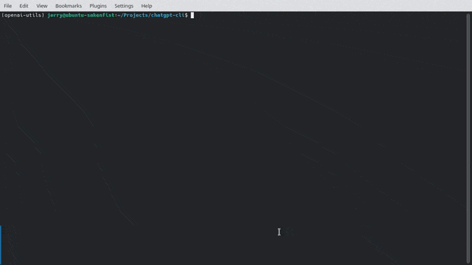

# ChatGPT CLI

[](https://pypi.org/project/chatgpt-cli-md/) [](https://pypi.org/project/chatgpt-cli-md/) [](https://pypi.org/project/chatgpt-cli-md/) [](https://github.com/efJerryYang/chatgpt-cli/stargazers)

[中文](README_zh.md)

## Introduction

ChatGPT CLI is a command-line interface tool that connects to the ChatGPT language model using OpenAI's official API key. It features markdown support, allowing you to structure your inputs in a readable and well-organized format for easier reference. The tool also saves conversations in `JSON` format, you can load them with `!load` command. Commands provided enable you to use this tool much like you would use the official web client. For more command usage, you can type `!help` or see more in the [Commands](#commands) section.

Here is a simple demonstration of how to use it:



<!-- For more detailed information, please check out the `<link_to_docs>`. -->

## Prequisites

To run the ChatGPT CLI tool, you'll need to have Python version 3.8 or higher installed on your machine. You can check your Python version by typing `python -V` in your terminal. We require version at least `3.8` because the feature of `importlib.metadata` is only available from this version. You'll also need an OpenAI API key, which you can easily [get here](https://platform.openai.com/account/api-keys).

The required Yython packages can be installed with `pip install -r requirements.txt`, which includes the following:

- `openai >= 0.27.0`
- `pyyaml >= 6.0`
- `rich >= 13.3.1`

## Installation

You can install ChatGPT CLI by downloading the package from the [latest release](https://github.com/efJerryYang/chatgpt-cli/releases) and running either of the following commands. Note that you will need to replace `<version>` with the version number of the package you downloaded (e.g. `0.1.0`).

You can also install the package from PyPI by running `pip install chatgpt-cli-md`.

```sh
pip install chatgpt-cli-md-<version>.tar.gz
```

```sh
pip install chatgpt_cli_md-<version>-py3-none-any.whl
```

This will automatically install all the required dependencies. You can also build the project and get the binary file to install by cloning the repository from GitHub and running the following commands:

```sh
git clone https://github.com/efJerryYang/chatgpt-cli.git
```

Install necessary dependencies:

```sh
pip install -r requirements.txt
```

Build the project into package:

```sh
python -m build
```

Once built, you can follow the instructions above to install the package. The built package will be located in `dist` directory.

We highly recommend that you use the latest version of ChatGPT CLI and install it using the recommended methods for optimal performance and stability.

## Getting Started

After installation, you can start the ChatGPT CLI tool by typing `chatgpt-cli` in your terminal.

```sh
chatgpt-cli
```

If you are running the tool for the first time, you will be prompted to configure your `config.yaml` file, and you can also import the `data` directory from your previous script version. If you do not have a configuration file in the path `${HOME}/.config/chatgpt-cli/config.yaml`, you can create a new one with the interactive setup procedure provided by the tool, or you can import the one you have already used in your previous version. If choose to create a new one, You will need to input your OpenAI API key and proxy settings (if any). You can also get an OpenAI API key [here](https://platform.openai.com/account/api-keys) if you do not have one.

After configuring your settings, a welcome panel with help information will be displayed, and you can start chatting with ChatGPT using a variety of commands.

A template of `config.yaml` is shown below:

```yaml
# ChatGPT CLI Configuration File
openai:
  api_key: <YOUR_API_KEY>
  default_prompt:
    - role: system
      content: You are ChatGPT, a language model trained by OpenAI. Now you are responsible for answering any questions the user asks.
proxy:
  http_proxy: http://127.0.0.1:7890
  https_proxy: http://127.0.0.1:7890
```

You can remove the `proxy` section or leave its value empty if you do not need to use a proxy.

## Commands

We've provided several commands to help you use this tool more conveniently. You don't need to remember all of them at once, as you can type `!help` whenever you want to have a look. The following is a list a available commands:

- `!help`: shows the help message
- `!show`: displays the current conversation messages
- `!save`: saves the current conversation to a `JSON` file
- `!load`: loads a conversation from a `JSON` file
- `!new` or `!reset`: starts a new conversation
- `!regen`: regenerates the last response
- `!resend`: resends your last prompt to generate response
- `!edit`: selects messages for editing
- `!drop`: selects messages for deletion
- `!exit` or `!quit`: exits the program

Features (under development):

- `!tmpl` or `!tmpl load`: select a template to use
- `!tmpl show`: show all templates with complete information
- `!tmpl create`: create a new template
- `!tmpl edit`: edit an existing template (not implemented yet)
- `!tmpl drop`: drop an existing template (not implemented yet)

These commands are designed to enable you to use this tool much like you would use the official web client. If you find that you need additional command support, feel free to open an issue.

## Todos

We have some todos for future improvements, such as:

- [x] Detect `[Ctrl]+[C]` hotkey and prompt to confirm exiting
- [ ] `!token`: Count tokens in conversation and display the total number
- [ ] `!sum`: Generate a summary of the conversation to reduce token usage
- [x] `!tmpl`: Choose system prompt templates
- [ ] `!conv`: Show conversation list, Delete and Rename saved conversations
- [ ] `!sys <command>`: Enable you to run system command

## Contributing

If you'd like to contribute to ChatGPT CLI, please feel free to submit a pull request or open an issue!

## References

- The idea of using the `rich.panel` package comes from [mbroton's chatgpt-api](https://github.com/mbroton/chatgpt-api).
- The `!sum` command for generating a summary of the current conversation to guide the user in continuing the conversation is inspired by 沙漏/u202e.

## License

This project is licensed under the MIT License - see the [LICENSE](LICENSE) file for details.
