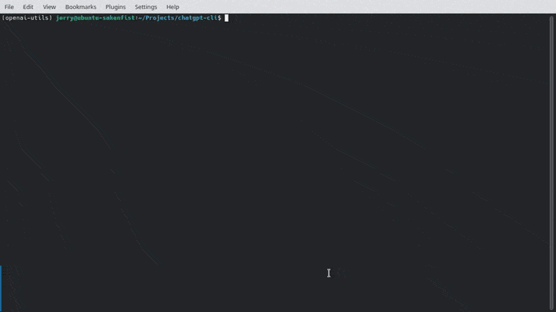

# ChatGPT CLI

## Introduction

ChatGPT CLI is a command-line interface tool that connects to the ChatGPT language model using OpenAI's official API key. With markdown support, it allows you to structure your inputs in a readable and well-organized format for future reference. Additionally, the tool saves conversations in JSON format and loads them when it starts.

Here is a simple demonstration of how to use it:



## Commands

We've provided serveral commands to help you use this tool more conveniently. You don't need to remember all of them to start, as you can type `!help` whenever you want to have a look:

- `!help`: shows the help message
- `!show`: displays the current conversation messages
- `!save`: saves the current conversation to a `JSON` file
- `!load`: loads a conversation from a `JSON` file
- `!new` or `!reset`: starts a new conversation
- `!regen`: regenerates the last response
- `!resend`: resends your last prompt to generate response
- `!edit`: selects messages for editing
- `!drop`: selects messages for deletion
- `!exit` or `!quit`: exits the program

These commands are designed to enable you to use this tool much like you would use the official web client. If you find that you need additinal command support, feel free to open an issue.

## Prequisites

To use ChatGPT CLI, you'll need to have Python 3.x installed on your machine. You can type `python -V` in your command line to see your python version, and the output of this command would look like this:

```sh
Python 3.11.2
```

You'll also need an OpenAI API key (which you can [get here](https://platform.openai.com/account/api-keys)).

The Python packages we used include `openai`, `pyyaml` and `rich`, which can be installed with `pip install -r requirements.txt`.

## Installation

To install ChatGPT CLI, simply clone this repository to your local machine:

```bash
git clone https://github.com/efJerryYang/chatgpt-cli.git
```

Then, navigate to the cloned repository and install the required dependencies:

```sh
pip install -r requirements.txt
```

To use this tool, you will need to have a `config.yaml` in the directory as your script `chat.py`. You can copy the content of `config.yaml.example` and repalce the api key placeholder with your own OpenAi API key.

If you're running the tool over a proxy, replace the `http://127.0.0.1:7890` with the address and port of your proxy server in the `http_proxy` and `https_proxy` fields respectively. If you're not using a proxy or you're not sure what to set these fields to, you can ignore the `proxy` field or delete it from your `config.yaml` file. Here is an example of a `config.yaml` file with a proxy:

```yaml
# config.yaml.example
openai:
  api_key: <YOUR_API_KEY>
  default_prompt:
    - role: system
      content: You are ChatGPT, a language model trained by OpenAI. Now you are responsible for answering any questions the user asks.
proxy:
  http_proxy: http://yourproxyserver.com:8080
  https_proxy: http://yourproxyserver.com:8080
```

Remember to replace `http://yourproxyserver.com:8080` with the address and port of your proxy server. If you don't want to use a proxy, you can delete the `proxy` field from your `config.yaml` file, like this:

```yaml
# config.yaml.example
openai:
  api_key: <YOUR_API_KEY>
  default_prompt:
    - role: system
      content: You are ChatGPT, a language model trained by OpenAI. Now you are responsible for answering any questions the user asks.
# no proxy field is okay to run this tool
```

## Running the Tool

You should have the following directory structure:

```txt
.
|-- chat.py
|-- config.yaml
|-- config.yaml.example
|-- data
|   |-- example.json
|   `-- example2.json
|-- LICENSE
|-- README.md
`-- requirements.txt
```

`chat.py` is the script to run, and `config.yaml` is the configuration file that sets up the runtime environment. The `data` directory should be created automatically the first time you run the script after you have installed the required dependencies.

To start using this tool, run the following command:

```sh
python chat.py
```

You can exit the tool by typing `!quit` command during your conversation, and the script will prompt you to choose storing the conversation or not once you make changes to current conversation. The `quit` command in previous versions is also supported.

To send a prompt to ChatGPT, hit the `[Enter]` key twice after your message. If you press `[Enter]` only once, it will create a new line, but if the message is blank, it will also be submitted to ChatGPT. Note that if you submit an empty message, only the stripped empty string will be sent directly to ChatGPT without any prompts.

## Todos

- [ ] Detect `[Ctrl]+[C]` hotkey and prompt to confirm exiting
- [ ] Count tokens in conversation and display the total number
- [ ] Generate a summary of the conversation to reduce token usage

## Contributing

If you'd like to contribute to ChatGPT CLI, please feel free to submit a pull request or open an issue!

## References

- The idea of using the `rich.panel` package comes from [mbroton's chatgpt-api](https://github.com/mbroton/chatgpt-api).
<!-- - The !summarize command for generating a summary of the current conversation to guide the user in continuing the conversation is inspired by 沙漏/u202e. -->

## License

This project is licensed under the MIT License - see the [LICENSE](LICENSE) file for details.
