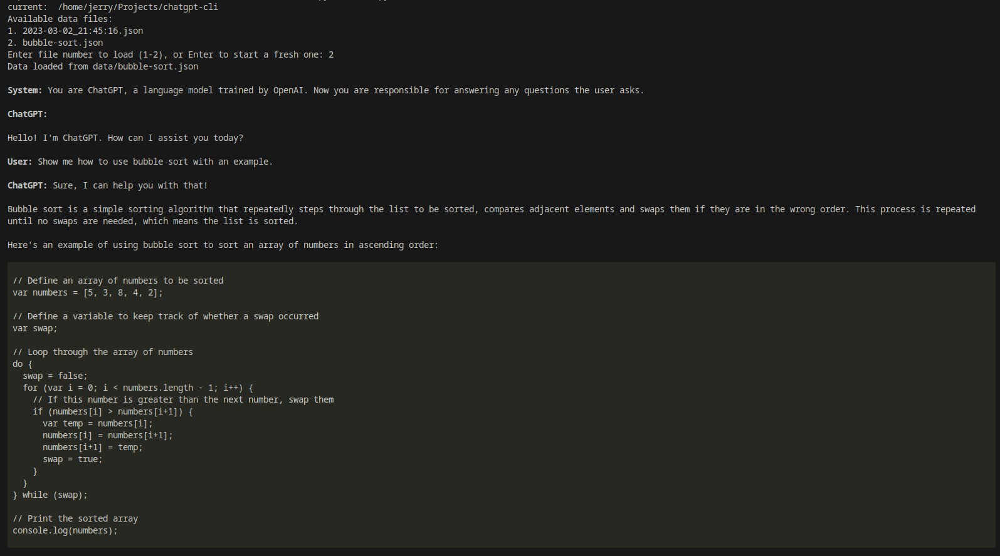
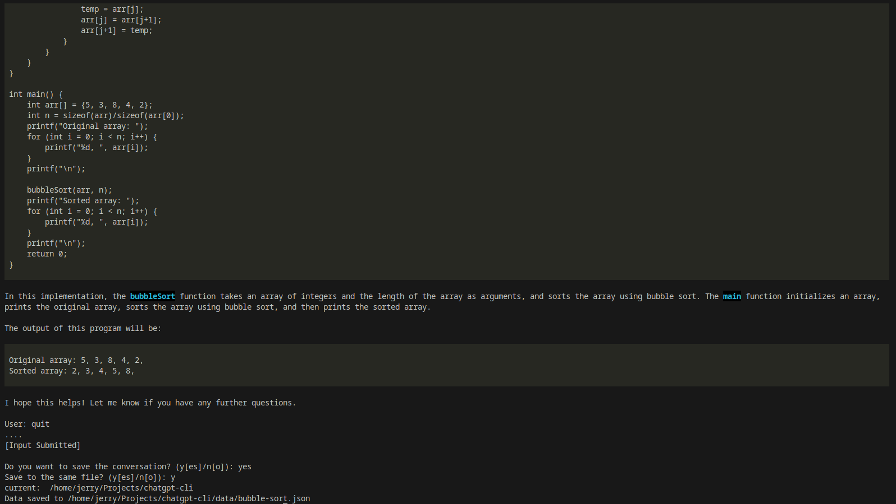

# ChatGPT CLI

ChatGPT CLI is a command-line interface tool that connects to the ChatGPT language model using OpenAI's official API key. With markdown support, it allows you to structure the inputs in a readable and well-organized format for future reference.

Additionally, the tool saves conversations in JSON format and can be loaded when it starts.

> **Notice:** The demo below is **not up-to-date**, you can try out the new features (command options like `!help`, `!show`, `!edit`, `!drop` and so on) yourself!

A simple demo here:





## Usage

### Prequisites

To use ChatGPT CLI, you'll need to have `Python` installed on your machine. `Python` version over `3.11.2` is supported, and the older version may also work.

You'll also need an OpenAI API key (which you can [get here](https://platform.openai.com/account/api-keys)).

### Installation

To install ChatGPT CLI, simply clone this repository to your local machine:

```bash
git clone https://github.com/efJerryYang/chatgpt-cli.git
```

Then, navigate to the cloned repository and install the required dependencies:

```bash
pip install -r requirements.txt
```

To use this tool, you will need to have a `config.yaml` in the directory you place your script `chat.py`. Here is an example:

```yaml
# config.yaml.example
openai:
  api_key: <YOUR_API_KEY>
  default_prompt:
    - role: system
      content: You are ChatGPT, a language model trained by OpenAI. Now you are responsible for answering any questions the user asks.
proxy:
  http_proxy: http://127.0.0.1:7890
  https_proxy: http://127.0.0.1:7890
```

### Running the Tool

You should have the following directory structure:

```txt
.
|-- chat.py
|-- config.yaml
|-- config.yaml.example
|-- data
|   |-- example.json
|   `-- example2.json
|-- LICENSE
|-- README.md
`-- requirements.txt
```

The `data` directory should be created automatically the first time you run the script.

You can then run the following to start using this tool. And you can exit the tool by typing `quit` during your conversation, the script will prompt you to choose storing the conversation or not.

```bash
python chat.py
```

You can submit a prompt to the ChatGPT by hitting `[Enter]` key twice, and input text with a single `[Enter]` will be interpreted as starting a newline.

## Contributing

If you'd like to contribute to ChatGPT CLI, please feel free to submit a pull request or open an issue!

## Reference

- The hint of using `rich.panel` packages comes from [mbroton's chatgpt-api](https://github.com/mbroton/chatgpt-api)

## License

This project is licensed under the MIT License - see the LICENSE file for details.
